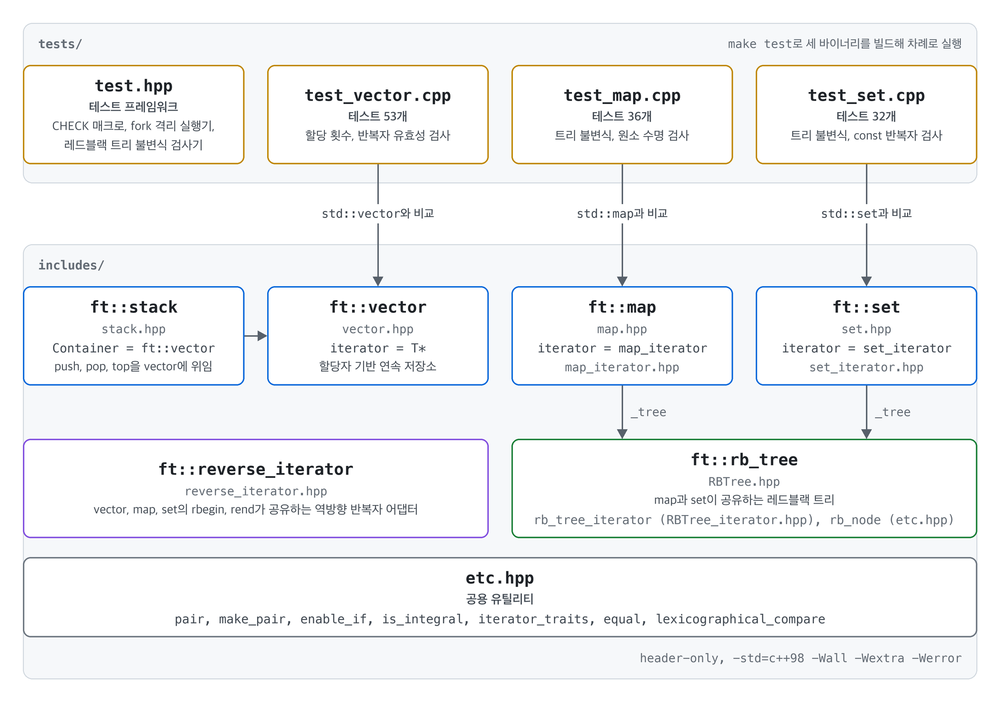

# ft_containers

C++98 표준만으로 STL의 `vector`, `stack`, `map`, `set`을 다시 구현하고, 121개의 테스트로 `std` 컨테이너와 같은 동작을 하는지 검증한 프로젝트입니다.

`make test` 한 번으로 세 개의 테스트 바이너리를 빌드하고 실행합니다. 테스트마다 자식 프로세스에서 격리 실행되므로, 검사 실패뿐 아니라 크래시와 타임아웃도 FAIL 한 줄로 보고됩니다.

## 아키텍처 다이어그램

<picture>
  <source media="(prefers-color-scheme: dark)" srcset="docs/architecture-dark.png">
  
</picture>

- `map`과 `set`은 하나의 레드블랙 트리 `rb_tree`를 공유하고, 각자의 반복자 어댑터로 트리 반복자를 감쌉니다.
- `stack`은 `vector`를 기본 컨테이너로 쓰는 어댑터입니다.
- 모든 컨테이너는 `etc.hpp`의 `pair`, `enable_if`, `is_integral`, `iterator_traits`와 비교 알고리즘을 공유합니다.
- 테스트는 같은 입력을 `std` 컨테이너와 `ft` 컨테이너에 넣고 결과를 비교하며, `map`과 `set`은 연산마다 레드블랙 트리 불변식도 검사합니다.

## 디렉터리 구조

```
ft_containers/
├── includes/
│   ├── vector.hpp             ft::vector
│   ├── stack.hpp              ft::stack (vector 기반 어댑터)
│   ├── map.hpp                ft::map
│   ├── set.hpp                ft::set
│   ├── RBTree.hpp             map과 set이 공유하는 레드블랙 트리
│   ├── RBTree_iterator.hpp    트리 양방향 반복자
│   ├── map_iterator.hpp       트리 반복자를 감싸는 map 반복자
│   ├── set_iterator.hpp       트리 반복자를 감싸는 set 반복자
│   ├── reverse_iterator.hpp   역방향 반복자 어댑터
│   └── etc.hpp                pair, rb_node, enable_if, is_integral, iterator_traits, 비교 알고리즘
├── tests/
│   ├── test.hpp               테스트 프레임워크 (CHECK 매크로, fork 격리 실행기, 레드블랙 트리 검사기)
│   ├── test_vector.cpp        vector 테스트 53개
│   ├── test_map.cpp           map 테스트 36개
│   └── test_set.cpp           set 테스트 32개
├── src/
│   └── main.cpp               std와 ft를 바꿔 끼워 실행 시간을 재는 벤치마크
├── docs/
│   ├── architecture-light.png 아키텍처 다이어그램 (밝은 테마)
│   └── architecture-dark.png  아키텍처 다이어그램 (어두운 테마)
└── Makefile                   test, bench, all, clean, fclean, re
```

## 실행 방법

`-std=c++98`을 지원하는 C++ 컴파일러(clang 또는 gcc)와 `make`가 필요합니다. 모든 소스는 `-Wall -Wextra -Werror -std=c++98`로 컴파일됩니다.

### 테스트

```sh
make test
```

`tests/test_*.cpp`를 `build/tests/` 아래에 각각 빌드한 뒤 순서대로 실행합니다. 검사가 하나라도 실패하면 종료 코드가 0이 아니므로 CI에서 그대로 쓸 수 있습니다.

스위트 하나만 실행하려면 바이너리를 직접 빌드합니다.

```sh
make build/tests/test_vector && ./build/tests/test_vector
```

| 옵션 | 효과 |
| --- | --- |
| `NO_COLOR=1 make test` | 색 출력을 끕니다. 파이프나 파일로 보낼 때는 자동으로 꺼집니다. |
| `TEST_NO_FORK=1 make test` | fork 없이 같은 프로세스에서 실행합니다. 디버거를 붙일 때 씁니다. |
| `make test DEBUG=true` | `-g`를 붙여 디버그 정보를 넣습니다. |

### 벤치마크

```sh
make bench
```

`src/main.cpp`를 `USE_STL=1`(std)과 `USE_STL=0`(ft)로 각각 빌드해 실행 시간을 비교합니다. 약 4GB 크기의 `vector`를 채우므로 메모리 여유가 있을 때 실행하세요.

### 정리

```sh
make fclean
```
