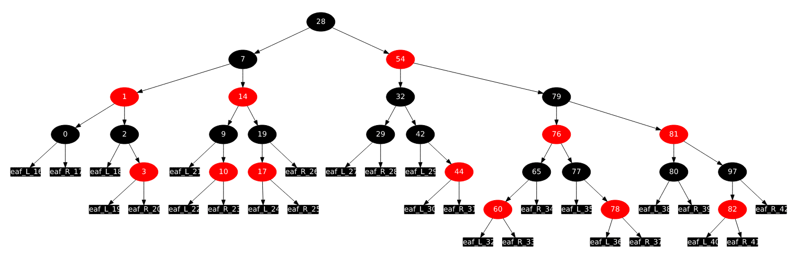

# ft_containers 과제 (한글 번역)

42 과제 ft_containers 원문 PDF(version 5.2)를 한글로 옮긴 문서입니다. 컨테이너 이름, 함수 이름, 컴파일 플래그, Makefile 규칙 이름은 원문 그대로 두었습니다. 보너스 파트의 레드블랙 트리 그림은 원문 PDF에서 추출해 그대로 실었습니다.

> **부제:** C++ containers, easy mode
>
> **요약:** 표준 C++ 컨테이너는 저마다 정해진 쓰임새가 있습니다. 그것들을 제대로 이해했는지 확인하기 위해, 직접 다시 구현해 봅시다!

## 목차

1. [목표](#1장-목표)
2. [공통 규칙](#2장-공통-규칙)
3. [필수 파트](#3장-필수-파트)
4. [보너스 파트](#4장-보너스-파트)
5. [제출과 동료 평가](#5장-제출과-동료-평가)

## 1장 목표

이 프로젝트에서는 C++ 표준 템플릿 라이브러리의 컨테이너 몇 가지를 구현합니다.

각 표준 컨테이너의 구조를 기준으로 삼아야 합니다. 표준 컨테이너에 Orthodox Canonical Form의 일부가 빠져 있다면, 그 부분은 구현하지 않습니다.

다시 한번 강조하지만 C++98 표준을 따라야 합니다. 따라서 그 이후에 추가된 컨테이너 기능은 **절대 구현하면 안 되고**, C++98의 모든 기능은 (폐기 예정인 것까지) 구현해야 합니다.

## 2장 공통 규칙

### 컴파일

- `c++`를 사용해 `-Wall`, `-Wextra`, `-Werror` 플래그로 코드를 컴파일해야 합니다.
- `-std=c++98` 플래그를 추가해도 코드가 컴파일되어야 합니다.
- 소스 파일을 컴파일하는 Makefile을 제출해야 합니다. Makefile은 불필요한 relink를 해서는 안 됩니다.
- Makefile에는 최소한 `$(NAME)`, `all`, `clean`, `fclean`, `re` 규칙이 있어야 합니다.

### 형식과 이름 규칙

- 컨테이너마다 알맞은 이름을 붙인 클래스 파일을 제출합니다.
- *Norminette여 안녕!* 강제되는 코딩 스타일은 없습니다. 원하는 스타일을 따르면 됩니다. 다만 동료 평가자가 이해할 수 없는 코드는 채점할 수도 없다는 점을 기억하세요. 최대한 깔끔하고 읽기 쉬운 코드를 작성하세요.

### 허용과 금지

이제 C가 아니라 C++로 코딩합니다. 그러니:

- 표준 라이브러리의 모든 것을 사용할 수 있습니다. 익숙한 것만 고집하기보다, 이미 알고 있는 C 함수의 C++ 버전을 최대한 활용하는 것이 현명합니다.
- 하지만 그 밖의 외부 라이브러리는 사용할 수 없습니다. C++11(과 그 파생 형태)과 Boost 라이브러리는 금지입니다. 다음 함수도 금지입니다: `*printf()`, `*alloc()`, `free()`. 사용하면 점수는 0점이고, 그것으로 끝입니다.

### 몇 가지 설계 요구사항

- 메모리 누수는 C++에서도 일어납니다. 메모리를 할당했다면 **메모리 누수**를 막아야 합니다.
- 헤더 파일에 함수 구현을 넣으면(함수 템플릿은 예외) 해당 과제는 0점입니다.
- 각 헤더는 다른 헤더와 독립적으로 사용할 수 있어야 합니다. 따라서 각 헤더가 필요한 의존성을 모두 include해야 합니다. 다만 **include guard**를 추가해 이중 include 문제는 피해야 합니다. 그렇지 않으면 0점입니다.

### 알아 두기

- 필요하면(예를 들어 코드를 나누기 위해) 파일을 추가해도 되고, 필수 파일만 제출한다면 작업을 원하는 대로 구성해도 됩니다.
- 오딘과 토르의 이름으로! 머리를 쓰세요!!!

> **주의:** 이 과제의 목표는 STL 컨테이너를 다시 만드는 것이므로, 당연히 여러분의 컨테이너를 구현하는 데 STL 컨테이너를 **사용할 수 없습니다**.

## 3장 필수 파트

다음 컨테이너를 구현하고, 필요한 `<container>.hpp` 파일과 Makefile을 제출하세요.

- `vector`
  - `vector<bool>` 특수화는 구현하지 않아도 됩니다.
- `map`
- `stack`
  - 기본 내부 컨테이너로 여러분의 `vector` 클래스를 사용합니다. 다만 STL 컨테이너를 포함한 다른 컨테이너와도 호환되어야 합니다.

> **참고:** `stack` 없이도 이 과제를 통과할 수 있습니다(80/100). 하지만 보너스 파트를 하려면 필수 컨테이너 세 개(`vector`, `map`, `stack`)를 모두 구현해야 합니다.

다음도 구현해야 합니다.

- `std::iterator_traits`
- `std::reverse_iterator`
- `std::enable_if`
  - 네, C++11 기능이지만 C++98 방식으로도 구현할 수 있습니다. SFINAE를 접해 보라는 뜻에서 요구하는 것입니다.
- `std::is_integral`
- `std::equal` 그리고/또는 `std::lexicographical_compare`
- `std::pair`
- `std::make_pair`

### 요구사항

- 네임스페이스는 `ft`여야 합니다.
- 컨테이너에 사용하는 내부 자료구조는 모두 논리적이고 정당한 근거가 있어야 합니다(`map`에 단순 배열을 쓰는 것은 안 됩니다).
- 표준 컨테이너가 제공하는 것보다 많은 public 함수를 구현할 수 없습니다. 그 외에는 모두 private이나 protected여야 합니다. public 함수나 변수 하나하나에 **정당한 근거**가 있어야 합니다.
- 표준 컨테이너의 모든 멤버 함수, 비멤버 함수, 오버로드를 구현해야 합니다.
- 원래 이름을 그대로 따라야 합니다. 세부 사항에 신경 쓰세요.
- 컨테이너에 **반복자** 체계가 있다면 그것도 구현해야 합니다.
- `std::allocator`를 사용해야 합니다.
- 비멤버 오버로드에는 `friend` 키워드를 쓸 수 있습니다. `friend`를 쓴 곳마다 정당한 근거가 있어야 하며, 평가 때 확인합니다.
- 물론 `std::map::value_compare` 구현에도 `friend` 키워드를 쓸 수 있습니다.

> **참고:** [cplusplus.com](https://www.cplusplus.com/)과 [cppreference.com](https://cppreference.com/)을 참고 자료로 사용할 수 있습니다.

### 테스트

- 디펜스를 위한 테스트도 제공해야 합니다. 최소한 `main.cpp` 하나는 있어야 합니다. 예시로 주어진 main보다 더 나아가야 합니다!
- 같은 테스트를 실행하는 바이너리 두 개를 만들어야 합니다. 하나는 여러분의 컨테이너만, 다른 하나는 STL 컨테이너를 사용합니다.
- **출력**과 **성능 / 실행 시간**을 비교하세요(여러분의 컨테이너는 최대 20배까지 느려도 됩니다).
- 컨테이너는 `ft::<container>`로 테스트하세요.

> **참고:** 인트라넷 프로젝트 페이지에서 `main.cpp` 파일을 내려받을 수 있습니다.

## 4장 보너스 파트

마지막 컨테이너 하나를 더 구현하면 추가 점수를 받습니다.

- `set`

단, 이번에는 **레드블랙 트리**가 **필수**입니다.

> **주의:** 보너스 파트는 필수 파트가 완벽할 때만 평가합니다. 완벽하다는 것은 필수 파트가 빠짐없이 구현되었고 오동작 없이 동작한다는 뜻입니다. 필수 요구사항을 모두 통과하지 못하면 보너스 파트는 전혀 평가되지 않습니다.

## 5장 제출과 동료 평가

평소처럼 Git 저장소에 과제를 제출하세요. 디펜스 중에는 저장소 안의 작업만 평가됩니다. 파일 이름이 올바른지 꼭 다시 확인하세요.
